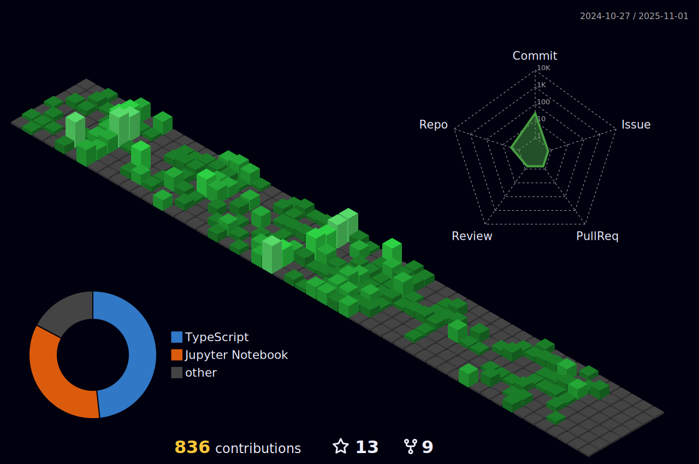

# Pedro Araujo (aka Peu / Peuweb)

👋 Hi there! I'm Pedro Araujo, but you can call me Peu or Peuweb. I'm a Senior Software Engineer passionate about building new digital products and collaborating with other product developers.

## 🚀 What I'm Focused On

- Creating and launching innovative digital products
- Seeking partnerships with fellow product developers
- My current favorite stack: **Next.js** for the frontend and any backend language I master

## GitHub Contribution Overview

  

<table border="0" cellspacing="0" cellpadding="0">
  <tr>
    <td>
      
    </td>
  </tr>
  <tr>
    <td>
      
    </td>
  </tr>
  <tr>
    <td>
      
    </td>
  </tr>
  <tr>
    <td>
      <!-- Devicons: List of main languages and frameworks -->
      

        
        
        
        
        
        
        
        
        
        
        
        
        
        
        
        
        
        
        
        
      

    </td>
  </tr>
</table>

---

Let's build something amazing together! If you're looking for a partner to create digital products, feel free to reach out.
